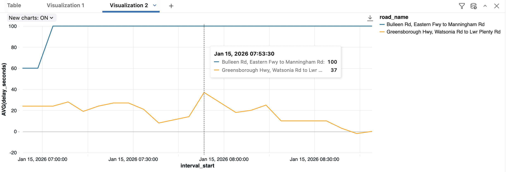

# Victoria Real-Time Traffic Pipeline (Kafka + Streaming ETL)

This repo is a learning-first project to practice **data-in-motion** with a real public dataset:

- **Source**: Victoria Transport Open Data (Bluetooth Travel Time)
- **Buffer**: Kafka-compatible broker (local Redpanda first, then Confluent Cloud)
- **Consumers**: (1) local dump-to-files for schema discovery, (2) Databricks Spark Structured Streaming → Delta

## Phase 0 (Start Here): Get API access

1. Go to the Transport Victoria Open Data portal dataset page for **Bluetooth Travel Time**.
2. Create an account / sign in.
3. Find the dataset's API access section and **generate an API key**.
4. Find the **API endpoint URL** for the feed you want (there may be multiple endpoints/filters).

Because portals vary, this repo supports multiple auth header styles.

- If the portal says:
  - `x-api-key: <YOUR_KEY>` → set `VIC_API_KEY_HEADER=x-api-key`, `VIC_API_KEY_PREFIX=` (empty)
  - `Authorization: Bearer <YOUR_KEY>` → set `VIC_API_KEY_HEADER=Authorization`, `VIC_API_KEY_PREFIX=Bearer `

## Phase 0: Run local Kafka (Redpanda)

Prereqs: Docker Desktop installed and running.

Start the broker:

```bash
docker compose up -d
```

Create the topic:

```bash
docker exec -it traffic_redpanda rpk topic create traffic_raw --partitions 3 --replicas 1 --brokers localhost:9092
```

## Phase 0: Install Python deps

```bash
python3 -m venv .venv
source .venv/bin/activate
pip install -r requirements.txt
```

## Phase 0: 10-minute schema discovery run

### 1) Run the consumer (dump messages to local files)

This writes newline-delimited JSON to `./data/raw/traffic_raw_*.jsonl`.

```bash
export KAFKA_BOOTSTRAP_SERVERS=localhost:9092
python -m src.consumer_dump --topic traffic_raw --out-dir ./data/raw
```

### 2) Run the producer (poll API and publish raw JSON)

Set your endpoint + API auth:

```bash
export VIC_API_URL="PASTE_THE_BLUETOOTH_TRAVEL_TIME_ENDPOINT_HERE"
export VIC_API_KEY="PASTE_YOUR_KEY_HERE"
export VIC_API_KEY_HEADER="x-api-key"          # or Authorization
export VIC_API_KEY_PREFIX=""                   # or "Bearer "
export KAFKA_BOOTSTRAP_SERVERS=localhost:9092
```

Run for ~10 minutes (you can change interval/duration):

```bash
python -m src.producer_poll --topic traffic_raw --interval-seconds 300 --duration-seconds 600
```

Afterward, open the `.jsonl` files in `./data/raw` to inspect the schema.

## Kafka reliability checks (one command)

This repo includes a quick status script that helps answer:

- Did Kafka store messages (end offsets)?
- Did my consumer group commit offsets (lag)?
- Did my local dump consumer write JSONL, and how many messages per 5-minute window?

Run:

```bash
cd /Users/yinli/Desktop/traffic_kafka
source .venv/bin/activate
python -m src.status_check --topic traffic_raw --group-id traffic_dump --out-dir ./data/raw --window-minutes 5 --since-minutes 120
```

See also: `docs/kafka_status_check.md` for a step-by-step explanation of offsets, lag, and common failure modes.

## Next phases

- **Confluent Cloud**: the same producer/consumer can be pointed at Confluent Cloud by setting SASL env vars.
- **Databricks**: run the `databricks/traffic_stream.py` PySpark script once you’ve got data in Confluent Cloud.

## Databricks Free Edition (no Confluent required): Pipeline SQL over uploaded JSONL

If you want to practice Databricks “Streaming Tables/SQL” without Kafka connectivity:

1. Upload your local dump file `data/raw/traffic_raw_*.jsonl` into Databricks and create a table from it.\n
   Recommended table name: `workspace.default.traffic_raw_file_bronze`\n
2. Create a Databricks Pipeline and add SQL transformations.\n
   Use the SQL files in:\n
   - `databricks/pipeline/transformations/traffic_bronze.sql`\n
   - `databricks/pipeline/transformations/traffic_silver.sql`\n
   - `databricks/pipeline/transformations/traffic_silver_dedup.sql`\n
   - `databricks/pipeline/transformations/dim_link.sql`\n
   - `databricks/pipeline/transformations/fact_link_interval.sql`\n
   - `databricks/pipeline/transformations/fact_kafka_monitor_5m.sql`\n
   - `databricks/pipeline/transformations/traffic_delay_agg.sql`\n
3. Run the pipeline.\n

Notes:\n
- Streaming tables are incremental; if you change definitions or want to reprocess the same upload, use **Reset/Full refresh** in the Pipeline UI.\n
- `traffic_silver.sql` intentionally does **not** require `enough_data=true` by default because the sample file often has `enough_data=false`.\n

## Example visualization (Gold)

This chart is built from `workspace.default.traffic_delay_agg` (avg delay over a sliding window):



## Confluent Cloud (later): required env vars for Python producer/consumer

Set these in addition to `KAFKA_BOOTSTRAP_SERVERS`:

```bash
export KAFKA_SECURITY_PROTOCOL=SASL_SSL
export KAFKA_SASL_MECHANISM=PLAIN
export KAFKA_SASL_USERNAME="YOUR_CONFLUENT_API_KEY"
export KAFKA_SASL_PASSWORD="YOUR_CONFLUENT_API_SECRET"
```


